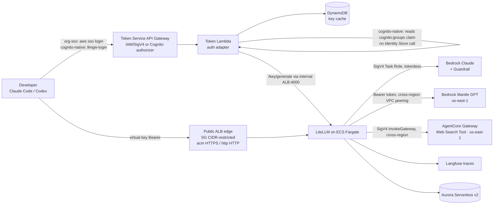

# Architecture — Code Agent Governance Gateway

## What this solution is

A **single governed gateway** that lets internal developers use code agents (Claude Code, Codex/Codex CLI) against Amazon Bedrock — while the organization centrally controls **identity (who)**, **model & cost (what / how much)**, **content safety (what flows)**, and **observability (trace)**. It implements identity-enforced access **without** LiteLLM Enterprise by minting per-user virtual keys behind an auth-mode-specific token service: IAM/SigV4 for IdC **organization** instances (`org-sso`), or a Cognito User Pools authorizer for `cognito-native` (used when org-sso is unavailable — e.g. an IdC account instance, which cannot host the SAML app IdC federation would require).

## The 10 CDK stacks (fixed order, zero circular deps)

`Network → Data → Guardrail → AgentCoreGateway(us-east-1) → LiteLLM → Langfuse(conditional) → Auth → Observability → MantleNetwork(us-east-1) → MantlePeeringRoutes`

> **CloudFront/CdnStack removed** (was the former 11th stack). The ALB is now the public edge — TLS is chosen by `config.litellm.certMode` (`acm` / `http`) inside `LiteLLMStack`; the public ALB is always internet-facing with SG ingress restricted to `litellm.albIngressCidrs`, and Langfuse (acm only) gets its own public ALB. There is no separate us-east-1 CDN stack, no `*.cloudfront.net`, no us-east-1 CloudFront viewer cert, and no Location-rewrite CloudFront Function.

| Stack | Responsibility | WHY it exists |
|-------|----------------|---------------|
| **NetworkStack** | VPC (configurable AZs/NAT, region = `config.awsRegion`), 3 subnet tiers (public / private-egress / isolated), full security-group chain, Gateway endpoints (S3, DynamoDB) + Interface endpoints (bedrock-runtime, secrets, ssm, ecr, ecr-docker, logs, bedrock-agentcore) | Keep Bedrock/AgentCore/AWS API traffic inside the VPC; least-privilege SG chain so each tier only reaches what it must. |
| **DataStack** | Aurora Serverless v2 (PostgreSQL) in isolated subnets, `storageEncrypted`, separate generated secrets for LiteLLM and Langfuse DBs, a `db-init` Custom Resource that creates the Langfuse user/database | Single managed Postgres backs both LiteLLM (key/spend state) and Langfuse (traces). Serverless v2 scales to near-zero for dev. |
| **GuardrailStack** | Bedrock Guardrail: content filters, denied topics, PII block + regex for generic API keys | Central content/PII policy that LiteLLM references by ID/version for every Claude request. |
| **AgentCoreGatewayStack** *(us-east-1)* | AgentCore Gateway (MCP, **AWS_IAM** inbound) + built-in **Web Search Tool** connector (`connectorId=web-search`) + gateway service role | Fully-managed web search for agents; replaces the former self-hosted Tavily MCP. See `shared/patterns/agentcore-websearch.md`. |
| **LiteLLMStack** | ECS Fargate (ARM64/Graviton) running LiteLLM behind an **ALB edge** (CloudFront removed — the ALB is the public entry). TLS is chosen by `config.litellm.certMode`: `acm` = internet-facing ALB terminating HTTPS:443 (regional ACM cert), `http` = internet-facing ALB on HTTP:80 (no cert; plaintext, PoC-only). In **both** modes the public ALB's SG ingress is restricted to `litellm.albIngressCidrs`. A separate **internal ALB (HTTP:4000)** always exists for the Token Service (its SSM URL is unchanged). ALB `idleTimeout` (default 900s, max 4000s) governs long completions. Task Role invokes Bedrock (Claude, **SigV4/tokenless**), bedrock-mantle (GPT-5.x, via a **Bearer token minted at runtime from the Task Role** — see the callback note below), `bedrock-agentcore:InvokeGateway` (SigV4), and `aws-marketplace:Subscribe`. Owns the master-key secret; publishes its internal URL to SSM. Installs `aws-bedrock-token-generator` (via `uv`) + a `mantle_token_refresh` callback. | The governance gateway itself. Claude auth is tokenless SigV4; Mantle needs a short-term Bearer key (no SigV4 path) written to `BEDROCK_MANTLE_API_KEY` (never `AWS_BEARER_TOKEN_BEDROCK`). |
| **LangfuseStack** *(conditional — `certMode='acm'` only)* | Self-hosted Langfuse on Fargate behind its **own internet-facing ALB + ACM cert** (+ Route53 alias, HTTP→443 redirect). Gated by `enableLangfuse` **and** `certMode='acm'` (Langfuse UI needs a real domain/cert — schema fail-fast otherwise). | Prompt/trace-level observability. Optional to reduce surface/cost; `http` deploys are CloudWatch-only (Langfuse not deployed). |
| **AuthStack** | Auth-mode-aware Token Service. `org-sso`: API Gateway (AWS_IAM) → VPC Lambda parses the caller's SSO ARN and enforces `AWSReservedSSO_`. `cognito-native`: creates a Cognito User Pool (sole identity source) + Hosted UI + app client (PKCE) + User Pool Groups (= teams); API Gateway `CognitoUserPoolsAuthorizer` verifies the JWT and the Lambda reads the `cognito:groups` claim (no Identity Store). Both issue/cache LiteLLM virtual keys in DynamoDB. Consumes `config.sso` or `config.cognitoNative` and emits onboarding outputs. | Enforces strong identity without LiteLLM Enterprise; the trust anchor is either the IAM-signed SSO role ARN (`org-sso`) or a Cognito-issued JWT (`cognito-native`). No IdC federation on account instances (SAML app unsupported). |
| **ObservabilityStack** | CloudWatch usage dashboard: token usage by model & team, spend, latency, failures (EMF metrics from the `cloudwatch_usage` callback), per-user top-N + hourly-activity Logs Insights tables, ALB requests/5xx | Usage + infra/cost observability out of the box — per-user token accounting without Langfuse; complements Langfuse's prompt-level view. |
| **MantleNetworkStack** *(us-east-1)* | Mantle peer VPC + `com.amazonaws.us-east-1.bedrock-mantle` interface endpoint + **cross-region VPC peering** (acceptance custom resource) + peer-side routes + cross-region private hosted zone | Reach Bedrock Mantle (GPT-5.x) privately in Virginia from any gateway region. See `shared/patterns/mantle-peering.md`. |
| **MantlePeeringRoutesStack** *(primary region)* | The primary VPC's `peerCidr → pcx` routes (CfnRoute is regional, so the primary-side routes live here) | Completes the bidirectional peering route without a NetworkStack↔Mantle cycle. |

## Cross-stack contract

`lib/interfaces.ts` defines append-only `*Exports` interfaces; each stack implements its interface as public readonly fields and downstream stacks receive them via props. This makes coupling explicit and compile-time checked. Runtime-only wiring (LiteLLM internal URL → Token Service) goes through **SSM Parameter Store by name** rather than a deploy-time reference.

## End-to-end request lifecycle

1. Developer authenticates through the selected auth mode:
   - `org-sso`: `aws sso login` obtains permission-set AWS credentials.
   - `cognito-native`: `llmgw-login` opens the **Cognito Hosted UI** (Cognito's own email/password form — no external IdP, no IdC), completes the PKCE flow, and caches the Cognito tokens locally.
2. The token helper calls `/auth/token`:
   - `org-sso`: `get-gateway-token.sh` signs the request with SigV4.
   - `cognito-native`: `gateway_auth.py token` sends the Cognito **access token** (not the id_token — the Cognito authorizer 401s on an id_token).
3. Token Service validates the mode-specific trust anchor (API Gateway IAM authorizer for `org-sso`; Cognito User Pools authorizer for `cognito-native`, before the Lambda runs).
4. Lambda maps the authorization unit to a LiteLLM team: permission set name for `org-sso`; the single matching `cognito:groups` value (filtered by `teamGroupPrefix`) for `cognito-native` — read straight from the verified JWT, no Identity Store call.
5. Lambda returns a cached or freshly minted LiteLLM virtual key.
6. The client uses the virtual key as a Bearer token against the **gateway URL** (the `GatewayUrl` output = the ALB domain): `acm` = `https://<custom-domain>`, `http` = `http://<alb-dns>` (reachable only from the `albIngressCidrs` allowlist).
7. The public ALB terminates TLS (`acm`) or serves plain HTTP (`http`) → LiteLLM (ECS). The ALB `idleTimeout` (default 900s) absorbs long completions — there is no CloudFront 120s ceiling.
8. LiteLLM reaches the backends: **Claude via the Task Role (SigV4, tokenless)** through the Bedrock Guardrail; **Mantle (GPT-5.x) via a runtime-minted short-term Bearer token** (`BEDROCK_MANTLE_API_KEY`, refreshed by the `mantle_token_refresh` callback) in us-east-1 over the cross-region VPC peering; web search via the AgentCore Gateway's built-in Web Search Tool (`InvokeGateway`, SigV4); traces ship to Langfuse.

## Key design properties (the "why")

- **Mixed model auth** — Claude (`bedrock/`) is tokenless SigV4 via the Task Role (nothing to rotate). Mantle (`bedrock_mantle/`) has **no SigV4 path** on the Responses route, so a short-term Bedrock API key is minted at runtime from the Task Role's own credentials (`aws-bedrock-token-generator`) and kept fresh in-process by a callback — no long-term secret, no external scheduler. The token goes in `BEDROCK_MANTLE_API_KEY`, **never** `AWS_BEARER_TOKEN_BEDROCK` (boto3-reserved; it would hijack Claude's SigV4 too and 403 all Claude models).
- **Managed web search** — the AgentCore Gateway exposes a built-in **Web Search Tool** connector (us-east-1, `AWS_IAM` inbound); LiteLLM calls it with SigV4. No third-party API key, no self-hosted MCP runtime — queries never leave AWS. Clients register it via `claude mcp add-json` + `headersHelper` (dynamic virtual key).
- **Mantle in Virginia, privately** — GPT-5.x lives in us-east-1; a cross-region **VPC peering** + `bedrock-mantle` PrivateLink endpoint + cross-region private hosted zone keep mantle traffic off the public internet regardless of the gateway region. Mantle is an AWS Marketplace offering → the Task Role's `aws-marketplace:Subscribe` auto-subscribes on first call (the ALB `idleTimeout`, default 900s, absorbs the cold-start — there is no CloudFront 120s ceiling).
- **Selectable region** — the gateway platform region is `config.awsRegion` (authoritative); the AgentCore Web Search and Mantle stacks are pinned to us-east-1 (CloudFront/CDN removed, so there is no us-east-1 edge stack). ACM certs for the ALB are regional (`config.awsRegion`), not a us-east-1 CloudFront cert.
- **Identity at the edge** — `org-sso` uses IAM-signed API Gateway + SSO ARN parsing; `cognito-native` uses a Cognito User Pools authorizer + the verified `cognito:groups` claim (Cognito is the sole identity source, no IdC). Both provide strong identity without paid LiteLLM tiers; `config.sso` or `config.cognitoNative` drives onboarding outputs.
- **Defense in depth** — LiteLLM `hide-secrets` (pre-call, all models incl. Mantle) + Bedrock Guardrail (content/PII, Claude only) + scoped MCP access groups per virtual key.
- **Network isolation** — the ECS tasks + Aurora stay private (Aurora isolated, tasks in private-with-egress) and VPC endpoints keep AWS API traffic off the internet; the **public ALB** (internet-facing in both modes, SG ingress restricted to the `albIngressCidrs` allowlist — no AWS WAF) is the only internet-facing surface, and the **internal ALB:4000** (Token Service) is never internet-exposed.
- **Per-team governance** — each authorization unit (permission set in `org-sso`, Cognito User Pool Group in `cognito-native`) maps to its own LiteLLM team with a budget cap + model allowlist + MCP access. "economy/standard" is just one worked example of this generic per-team mechanism, not a fixed taxonomy.
- **Optionality** — Langfuse (acm only), the `certMode` TLS strategy (acm/http), and the Mantle private endpoint are all toggles, so a minimal PoC and a full enterprise rollout share one codebase.
