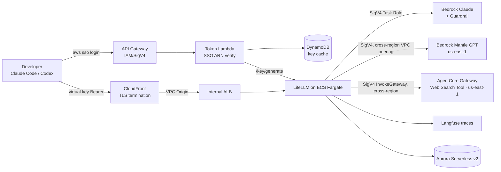

# Architecture — Code Agent Governance Gateway

## What this solution is

A **single governed gateway** that lets internal developers use code agents (Claude Code, Codex/Codex CLI) against Amazon Bedrock — while the organization centrally controls **identity (who)**, **model & cost (what / how much)**, **content safety (what flows)**, and **observability (trace)**. It implements SSO-enforced access **without** LiteLLM Enterprise by minting per-user virtual keys behind an IAM-authenticated token service.

## The 11 CDK stacks (fixed order, zero circular deps)

`Network → Data → Guardrail → AgentCoreGateway(us-east-1) → LiteLLM → Langfuse(conditional) → Auth → Observability → CDN(us-east-1) → MantleNetwork(us-east-1) → MantlePeeringRoutes`

| Stack | Responsibility | WHY it exists |
|-------|----------------|---------------|
| **NetworkStack** | VPC (configurable AZs/NAT, region = `config.awsRegion`), 3 subnet tiers (public / private-egress / isolated), full security-group chain, Gateway endpoints (S3, DynamoDB) + Interface endpoints (bedrock-runtime, secrets, ssm, ecr, ecr-docker, logs, bedrock-agentcore) | Keep Bedrock/AgentCore/AWS API traffic inside the VPC; least-privilege SG chain so each tier only reaches what it must. |
| **DataStack** | Aurora Serverless v2 (PostgreSQL) in isolated subnets, `storageEncrypted`, separate generated secrets for LiteLLM and Langfuse DBs, a `db-init` Custom Resource that creates the Langfuse user/database | Single managed Postgres backs both LiteLLM (key/spend state) and Langfuse (traces). Serverless v2 scales to near-zero for dev. |
| **GuardrailStack** | Bedrock Guardrail: content filters, denied topics, PII block + regex for generic API keys | Central content/PII policy that LiteLLM references by ID/version for every Claude request. |
| **AgentCoreGatewayStack** *(us-east-1)* | AgentCore Gateway (MCP, **AWS_IAM** inbound) + built-in **Web Search Tool** connector (`connectorId=web-search`) + gateway service role | Fully-managed web search for agents; replaces the former self-hosted Tavily MCP. See `shared/patterns/agentcore-websearch.md`. |
| **LiteLLMStack** | ECS Fargate (ARM64/Graviton) running LiteLLM behind an **internal** ALB (HTTP:4000; TLS at CloudFront). Task Role invokes Bedrock + bedrock-mantle + `bedrock-agentcore:InvokeGateway` + `aws-marketplace:Subscribe` via **SigV4 (no bearer tokens)**. Owns the master-key secret; publishes its internal URL to SSM. | The governance gateway itself. SigV4 via Task Role means nothing to rotate. |
| **LangfuseStack** *(conditional)* | Self-hosted Langfuse on Fargate, internal ALB. Gated by `enableLangfuse`. | Prompt/trace-level observability. Optional to reduce surface/cost. |
| **AuthStack** | SSO Token Service: API Gateway (AWS_IAM) → VPC Lambda parses the caller's SSO ARN, enforces `AWSReservedSSO_`, issues/caches a virtual key in DynamoDB. Consumes `config.sso` and emits SSO onboarding outputs. | Enforces SSO identity without LiteLLM Enterprise; the IAM-signed caller ARN is the trust anchor. |
| **ObservabilityStack** | CloudWatch dashboard (ALB requests/5xx, token service, Langfuse link) | Infra/cost observability; complements Langfuse's prompt-level view. |
| **CdnStack** *(us-east-1)* | CloudFront with **VPC Origin → internal ALB**, optional custom domain (ACM + Route53) or default `*.cloudfront.net`, a Location-rewrite Function. LiteLLM origin read/keepalive timeout raised to **60s** (Mantle cold-start subscribe). | ALBs are never internet-facing; CloudFront is the only public entry and terminates TLS. Pinned to us-east-1 because a CloudFront viewer **ACM cert must be us-east-1** (custom-domain mode); domain-less mode keeps the pin only for consistency. VPC Origin works cross-region (ALB in `config.awsRegion`). |
| **MantleNetworkStack** *(us-east-1)* | Mantle peer VPC + `com.amazonaws.us-east-1.bedrock-mantle` interface endpoint + **cross-region VPC peering** (acceptance custom resource) + peer-side routes + cross-region private hosted zone | Reach Bedrock Mantle (GPT-5.x) privately in Virginia from any gateway region. See `shared/patterns/mantle-peering.md`. |
| **MantlePeeringRoutesStack** *(primary region)* | The primary VPC's `peerCidr → pcx` routes (CfnRoute is regional, so the primary-side routes live here) | Completes the bidirectional peering route without a NetworkStack↔Mantle cycle. |

## Cross-stack contract

`lib/interfaces.ts` defines append-only `*Exports` interfaces; each stack implements its interface as public readonly fields and downstream stacks receive them via props. This makes coupling explicit and compile-time checked. Runtime-only wiring (LiteLLM internal URL → Token Service) goes through **SSM Parameter Store by name** rather than a deploy-time reference.

## End-to-end request lifecycle

1. `aws sso login` → developer has SSO credentials.
2. `get-gateway-token.sh` signs a request (SigV4) to API Gateway `/auth/token`.
3. API Gateway (AWS_IAM) passes the caller ARN to the Token Lambda.
4. Lambda verifies the `AWSReservedSSO_` prefix (rejects non-SSO with 403), maps the permission set to a tier team, and returns a cached or freshly minted LiteLLM virtual key.
5. The client uses the virtual key as a Bearer token against the CloudFront domain.
6. CloudFront (TLS) → internal ALB → LiteLLM (ECS).
7. LiteLLM signs Bedrock / Mantle / AgentCore Gateway calls with the **Task Role** (SigV4); Claude requests pass through the Bedrock Guardrail; Mantle (GPT-5.x) is reached in us-east-1 over the cross-region VPC peering; web search is the AgentCore Gateway's built-in Web Search Tool (`InvokeGateway`); traces ship to Langfuse.

## Key design properties (the "why")

- **Tokenless model auth** — Claude and Mantle both authenticate with the ECS Task Role via SigV4; there are no API keys/bearer tokens to store or rotate (no token-refresh scheduler).
- **Managed web search** — the AgentCore Gateway exposes a built-in **Web Search Tool** connector (us-east-1, `AWS_IAM` inbound); LiteLLM calls it with SigV4. No third-party API key, no self-hosted MCP runtime — queries never leave AWS.
- **Mantle in Virginia, privately** — GPT-5.x lives in us-east-1; a cross-region **VPC peering** + `bedrock-mantle` PrivateLink endpoint + cross-region private hosted zone keep mantle traffic off the public internet regardless of the gateway region. Mantle is an AWS Marketplace offering → the Task Role's `aws-marketplace:Subscribe` auto-subscribes on first call (CloudFront origin timeout raised to 60s to absorb the cold-start).
- **Selectable region** — the gateway platform region is `config.awsRegion` (authoritative); AgentCore Web Search, CDN, and Mantle stacks are pinned to us-east-1.
- **Identity at the edge** — IAM-signed API Gateway + SSO ARN parsing gives strong identity without paid LiteLLM tiers; `config.sso` drives onboarding outputs.
- **Defense in depth** — LiteLLM `hide-secrets` (pre-call) + Bedrock Guardrail (content/PII, Claude only) + scoped MCP access groups per virtual key.
- **Network isolation** — internal ALBs, isolated Aurora, VPC endpoints; CloudFront VPC Origin is the only public surface.
- **Per-org governance** — each SSO group/permission set (typically an organization/team) maps to its own LiteLLM team with a budget cap + model allowlist + MCP access. "economy/standard" is just one worked example of this generic per-team mechanism, not a fixed taxonomy.
- **Optionality** — Langfuse, custom domain, and the Mantle private endpoint are all toggles, so a minimal PoC and a full enterprise rollout share one codebase.
